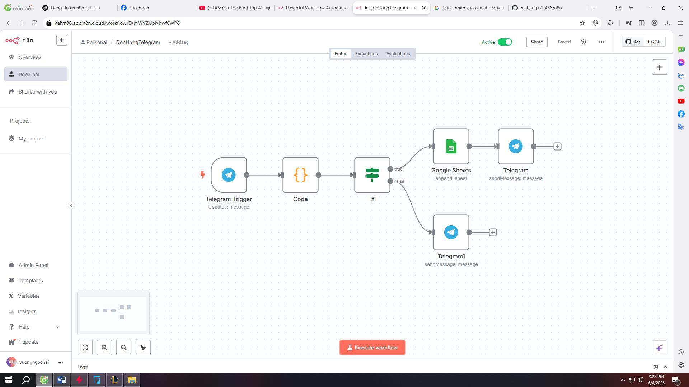

# Tạo file README.md với nội dung đã dịch sang tiếng Việt

# Workflow Đặt Hàng qua Telegram với n8n

Dự án này trình bày một quy trình tự động sử dụng [n8n](https://n8n.io) để thu thập đơn hàng từ người dùng Telegram, kiểm tra tính hợp lệ, lưu dữ liệu vào Google Sheets và gửi tin nhắn phản hồi.

## 📌 Tính năng nổi bật
- Kích hoạt qua Bot Telegram  
- Phân tích và xác thực dữ liệu đầu vào bằng JavaScript  
- Xử lý điều kiện với node `IF`  
- Thêm dữ liệu vào Google Sheets  
- Gửi tin nhắn xác nhận hoặc từ chối qua Telegram  

## 🧠 Tình huống sử dụng điển hình
Phù hợp với các doanh nghiệp nhỏ thu thập đơn hàng hoặc yêu cầu hỗ trợ qua Telegram mà không cần xây dựng backend riêng.

## 🔧 Công nghệ sử dụng
- n8n  
- Telegram Bot API  
- Google Sheets API  
- JavaScript  

## 📷 Giao diện Workflow

## 📥 Workflow xuất ra
Bạn có thể nhập file `DonHangTelegram.json` vào n8n để thử nghiệm hoặc mở rộng tùy ý.

